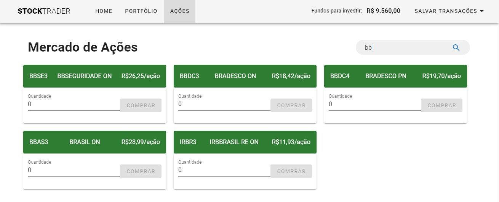

<h1 align="center">
  :heavy_dollar_sign: Stock Trader
</h1>

<p align="center">
  <a href="#trophy-lessons-learned">Lessons Learned</a>&nbsp;&nbsp;&nbsp;|&nbsp;&nbsp;&nbsp;
  <a href="#rocket-technologies--resources">Technologies</a>&nbsp;&nbsp;&nbsp;|&nbsp;&nbsp;&nbsp;
  <a href="#hammer-setting-up-the-environment">Environment Setup</a>&nbsp;&nbsp;&nbsp;|&nbsp;&nbsp;&nbsp;
  <a href="#zap-features-implementations">Features</a>
</p>

<p align="center">
  

  

  

  

  
</p>



Application developed during [Cod3r's official Vue.js course](https://www.udemy.com/course/vue-js-completo/), on Udemy, in order to simulate a Stock Exchange trading platform. Fake money, bur real shares market value fluctuations.

[Check out the application running!](https://stocktrader.vercel.app/)

## :trophy: Lessons Learned

- Building a full scalable Vue.js application;
- Getting tto know Vuetify :heart_eyes: (best Material Design components library)
- How to capture real-time shares values with Google Finance;
- How to publish a Google Sheets document publicly;
- How to turn Google Sheets into a REST API with a service provided by [Sheets.Best](https://sheet.best/);

## :rocket: Technologies & Resources

**Frontend:**
- Vue.js 2
- Vuex (official Vue's state manger)
- Vuetify 2
- Axios (HTTP client)

**Development:**
- Visual Studio Code
- Vue CLI & Node.js routines

## :hammer: Setting up the Environment

Make sure to have **Node.js 10+** installed in your machine and its **npm** available in the command line, then use the following routines:

```bash
$ npm install     # Download dependencies
$ npm run dev     # Run development server
$ npm run build   # Build files for production
```

Before running the application copy/rename file `.env.example` as `.env`. The existent value should work already, so no further configuration should be required. If you want to change the API to consume the stocks data, update the variable VUE_APP_API_URL that comes with the repository.

## :zap: Features Implementations

- [x] List all available shares in [BM&FBOVESPA](http://www.b3.com.br/);
- [x] Provide the user with R$10k to spend in the platform;
- [x] Allow basic operations of buying & selling shares at their instant price;
- [x] Stores user's wallet at browser's local storage;
- [ ] Fix layout responsiveness on small screens;
- [ ] Upgrade to Vue 3 and use Composition API;
